# 💰 Splitwise Clone


A full-stack **Expense Sharing System** inspired by Splitwise, developed as an **MCA Semester I Mini Project**. The application enables users to create groups, add shared expenses, track balances, and settle payments through a simple and user-friendly interface.

---

# 📖 Project Overview

Splitwise Clone is a web application that simplifies the management of shared expenses among friends, roommates, colleagues, or family members. Users can create groups, add members, record expenses, and automatically calculate each member's share.

---

# ✨ Features

## 👤 User Features

- User Registration & Login
- Secure Authentication
- Create Expense Groups
- Add Members to Groups
- Add Shared Expenses
- Automatic Expense Splitting
- View Group Balances
- Settle Outstanding Balances
- View Expense History
- Responsive Dashboard

---

## 👨‍💼 Admin Features

- Admin Login
- Manage Users
- Manage Groups
- Monitor Expenses
- View Group Information

---

# 🛠️ Tech Stack

## Frontend

- React.js
- Bootstrap 5
- HTML5
- CSS3
- JavaScript
- React Router

## Backend

- Node.js
- Express.js

## Database

- MySQL

## Tools

- Visual Studio Code
- Git & GitHub
- Postman

---

# 📂 Project Structure

```
splitwise-clone/
│
├── backend/
│   ├── routes/
│   ├── uploads/
│   ├── db.js
│   ├── server.js
│   └── package.json
│
├── frontend/
│   ├── src/
│   ├── public/
│   └── package.json
│
├── database/
│   └── splitwise.sql
│
├── screenshots/
│   ├── SignUp.jpg
│   ├── Login.jpg
│   ├── Dashboard.jpg
│   ├── AddGroup.jpg
│   ├── GropCreatedPage.jpg
│   ├── AddExpense.jpg
│   ├── AddAnExpense.jpg
│   ├── GroupBalances.jpg
│   ├── SettleUp.jpg
│   ├── AdminLogin.jpg
│   ├── ManageUsers.jpg
│   └── ManageGroups.jpg
│
├── README.md
└── .gitignore
```

---

# 🚀 Installation Guide

## 1. Clone the Repository

```bash
git clone https://github.com/TanviShevade/splitwise-clone.git
cd splitwise-clone
```

---

## 2. Install Dependencies

### Backend

```bash
cd backend
npm install
```

### Frontend

```bash
cd ../frontend
npm install
```

---

## 3. Database Setup

Create a MySQL database named:

```sql
splitwise
```

Import the SQL file:

```
database/splitwise.sql
```

Open:

```
backend/db.js
```

Update the database configuration if required:

```javascript
host: "localhost",
user: "root",
password: "",
database: "splitwise",
```

---

## 4. Run the Backend

```bash
cd backend
node server.js
```

Backend URL:

```
http://localhost:5000
```

---

## 5. Run the Frontend

```bash
cd frontend
npm run dev
```

Frontend URL:

```
http://localhost:5173
```

---

# 📸 Project Screenshots

### 📝 Sign Up
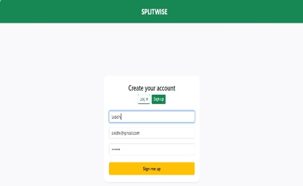

---

### 🔑 Login
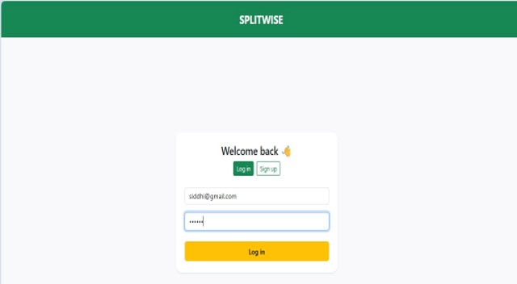

---

### 📊 Dashboard
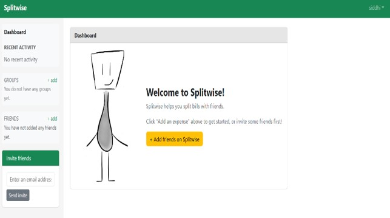

---

### 👥 Add Group
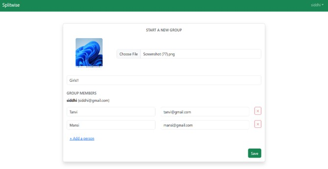

---

### ✅ Group Created
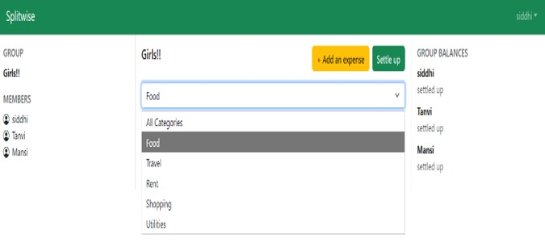

---

### 👨‍👩‍👧‍👦 Manage Groups
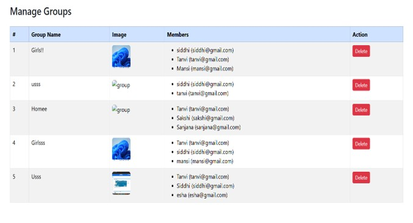

---

### 💰 Add Expense
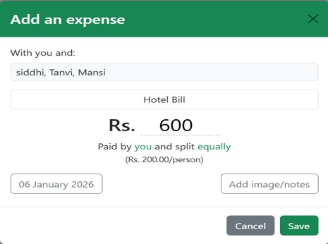

---

### ➕ Add an Expense
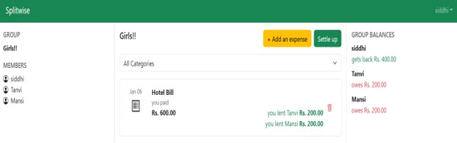

---

### ⚖️ Group Balances
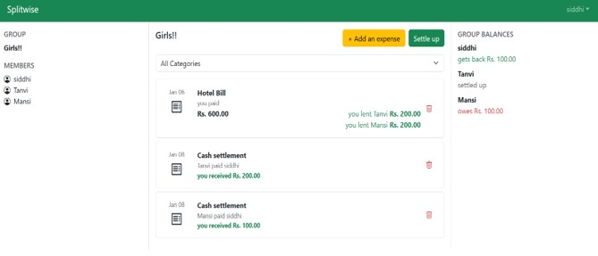

---

### 🤝 Settle Up
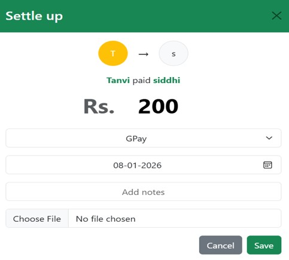

---

## 👨‍💼 Admin Panel

### 🔐 Admin Login
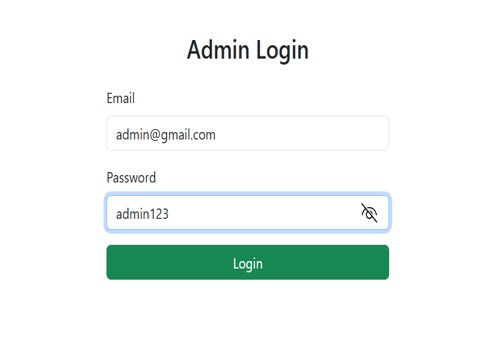

---

### 👥 Manage Users
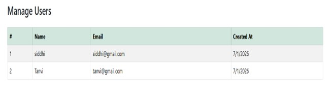

---

# 🌟 Key Functionalities

- Secure User Authentication
- Group Management
- Expense Tracking
- Automatic Expense Splitting
- Balance Calculation
- Settle Up Feature
- Admin Dashboard
- User Management
- Group Management
- Responsive User Interface

---

# 🔮 Future Enhancements

- Online Payment Gateway Integration
- Email Notifications
- Expense Analytics & Charts
- Multi-Currency Support
- Mobile Application
- Dark Mode
- Recurring Expenses
- Two-Factor Authentication (2FA)

---


# 👩‍💻 Developer

**Tanvi Shevade**

🎓 MCA Student

💻 Aspiring Full Stack Web Developer

### Connect with Me

- **GitHub:** https://github.com/TanviShevade
- **LinkedIn:** https://www.linkedin.com/in/tanvi-shevade-aabbb6280

---

# 📄 License

This project was developed as an **MCA Semester I Mini Project** for educational and learning purposes.
